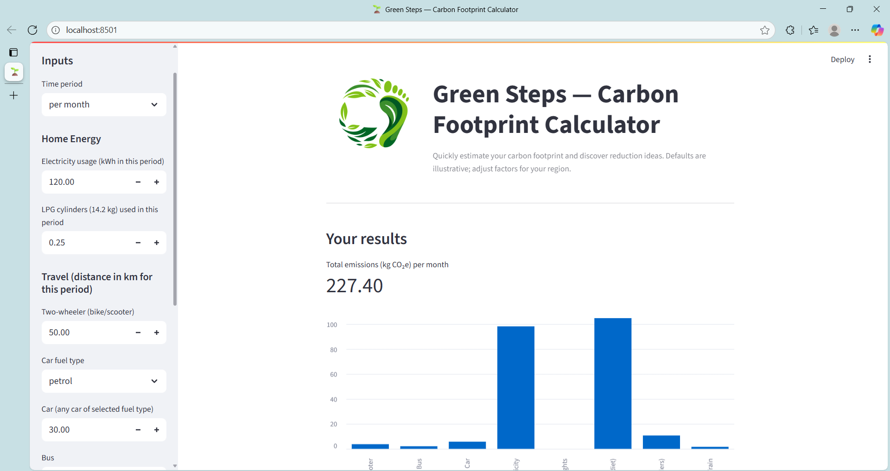
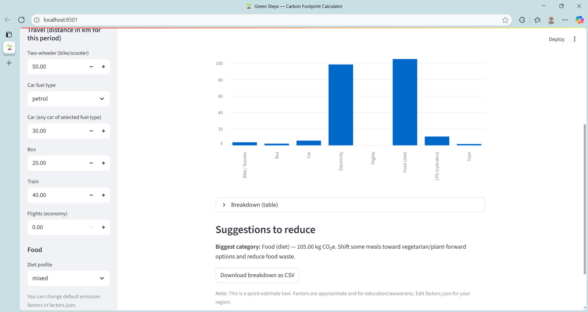

# 🌱 Green Steps — Carbon Footprint Calculator (Streamlit)
A simple, visual carbon footprint estimator built with **Python + Streamlit**. Enter your energy use, travel distances, and diet profile to see an instant breakdown of estimated emissions.

> ⚠️ **Disclaimer:** Emission factors in `factors.json` are **illustrative defaults** and can vary by source/region. Adjust to your local data if you have it.

## Screenshot




## 🔥 Demo
- Run locally (instructions below) and add a screenshot to this section.

## ✨ Features
- Friendly UI in the browser (Streamlit)
- Breakdown by category with a bar chart
- Editable emission factors via `factors.json`
- Download results as CSV
- Optional branding with your logo (`assets/logo.png`)

## 🧰 Tech Stack
- Python, Streamlit, Pandas

## 🖥️ Run Locally
```bash
# 1) Create and activate a virtual environment (Windows PowerShell)
python -m venv .venv
.\.venv\Scripts\Activate.ps1

# 2) Install deps
pip install -r requirements.txt

# 3) Run the app
streamlit run app.py